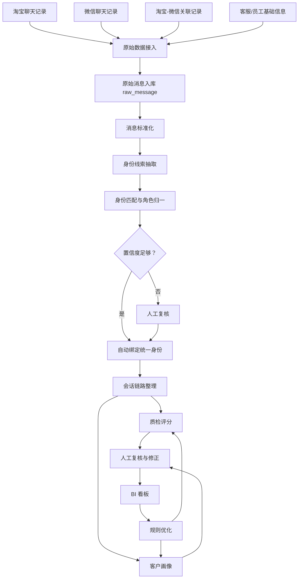

# 项目流程梳理

## 总流程

## 阶段拆分

### 1. 数据接入

- 从历史聊天数据库接口读取淘宝、微信、关联记录。
- 原始记录进入 `raw_message`，不直接覆盖。
- 支持全量同步、增量同步、去重、失败重试和同步日志。

### 2. 消息标准化

- 统一来源字段：`source_system`、`source_chat_id`、`source_sender_id`。
- 统一业务字段：`send_time`、`role_raw`、`content`。
- 识别消息类型：文本、图片、语音、文件、系统消息、自动回复。
- 标准化后的消息进入 `standard_message`。

### 3. 身份识别与角色归一

- 从聊天内容中抽取淘宝ID、订单号、手机号、微信号、客户姓名等线索。
- 根据线索匹配统一人员档案。
- 匹配结果保存匹配依据、置信度、来源消息ID。
- 低置信度结果进入人工复核。

### 4. 会话链路整理

- 按统一客户聚合淘宝与微信消息。
- 按时间、进群节点、订单号、需求主题切分会话。
- 识别参与人员、主要负责人和会话阶段。

### 5. 质检评分

- 识别客户问题。
- 计算客服首次响应、平均响应、最长等待。
- 判断回答专业度、服务态度、流程合规和风险行为。
- 生成可解释评分，并进入人工复核。

### 6. 客户画像

- 识别需求点：价格、效果、售后、物流、使用方法等。
- 判断客户意向等级、满意度和潜在客户价值。
- 生成客户标签和跟进状态。

### 7. 权限后台

- 超级管理员管理账号、角色、权限、规则和全局数据。
- 普通用户只能查看授权范围内的数据和任务。
- 重要操作写入审计日志。

### 8. BI 看板

- 客服评分排行。
- 响应时长趋势。
- 客户满意度趋势。
- 高意向客户数量。
- 异常会话和问题类型分布。
