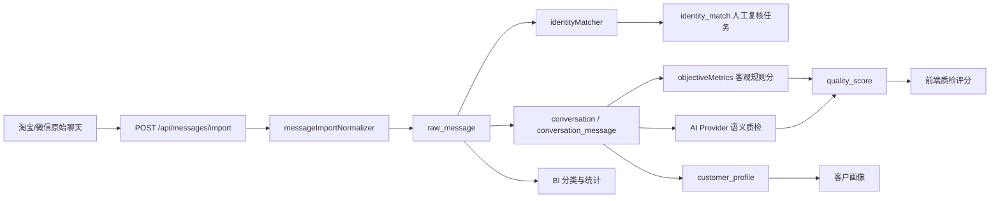

# 项目理解总览

生成时间：2026-06-16  
项目根目录：当前仓库根目录

## 1. 项目一句话

这是一个面向花卉园艺客服场景的客服质检系统：把淘宝和微信聊天记录接入 PostgreSQL，统一身份与会话链路，计算客观质检指标，再按不同登录角色展示 AI 质检、人工复核、客户画像和 BI 看板。

## 2. 当前运行态

- 后端：原生 Node HTTP 服务，默认本机端口 `8787`
- 前端：原生 HTML/CSS/JS 静态管理台，默认本机端口 `5173`
- 数据库：PostgreSQL，当前运行态已连接 `quality_inspection`
- 当前 API 观测：`/api/messages` 返回 42 条消息，其中淘宝 16 条、微信 26 条，含 text/image/video/voice
- 演示账号：`admin/admin123`、`qc/123456`、`service/123456`

## 3. 技术栈与目录

```text
backend/                    Node ESM 原生 HTTP API
  src/server.js              API 路由入口
  src/services/authService.js bearer token 签发与校验
  src/services/dataSource.js mock/PostgreSQL 分流门面
  src/services/postgres*.js  PostgreSQL 连接、查询、导入、映射
  src/services/*Matcher.js   身份匹配、指标计算、BI 分类
  src/prompts/               AI Provider 角色化 prompt
  src/config/domainProfile.js 花卉园艺业务规则

frontend/                   原生管理台
  server.js                 静态资源服务器
  src/api.js                API 客户端，失败时回退 mock
  src/app.js                单页应用主逻辑
  src/mock.js               离线演示数据与 mock 路由

database/postgresql/        PostgreSQL schema 与 demo seed
scripts/                    本地 PostgreSQL 启停、初始化、导入脚本
fixtures/                   花香园艺聊天导入样例
docs/                       产品流程、接口、数据库、AI prompt 文档
```

## 4. 主流程图



## 5. 架构层

| 层 | 关键文件 | 职责 |
| --- | --- | --- |
| 启动与路由 | `backend/src/server.js` | CORS、JSON 响应、API 路由分派、角色级接口授权，并把当前登录用户传递给数据源做范围过滤 |
| 认证服务 | `backend/src/services/authService.js` | HMAC bearer token 签发、校验、过期判断 |
| 数据源门面 | `backend/src/services/dataSource.js` | 判断 PostgreSQL 是否配置，失败时回退 mock；mock 回退也遵守客服本人数据范围 |
| 数据库适配 | `backend/src/services/postgresClient.js`, `postgresDataSource.js` | 连接池、SQL 查询、行到 API DTO 映射、消息导入、客服本人数据过滤 |
| 业务规则服务 | `messageImportNormalizer.js`, `identityMatcher.js`, `objectiveMetrics.js`, `biClassifier.js` | 导入校验、身份线索、客观指标、问题分类 |
| AI 质检 | `aiQualityService.js`, `backend/src/prompts/*` | 读取会话上下文，按角色调用可替换 AI Provider prompt |
| 前端应用 | `frontend/src/app.js`, `frontend/src/api.js`, `frontend/src/mock.js` | 登录、导航、各角色页面、AI 质检展示、mock 回退 |
| 数据库模型 | `database/postgresql/001_init.sql` | 权限、人员、平台账号、原始消息、身份匹配、会话、质检、客户画像 |

## 6. 业务领域模型

- 原始事实：`raw_message` 保存淘宝/微信消息，保留来源 ID、发送者、时间、角色、内容、多媒体解析字段和原始 payload；图片 OCR、语音/视频转写、媒体描述和解析审计信息先写入这里，再进入 AI 质检。
- 身份统一：`person` 是统一人，`platform_account` 是淘宝/微信账号，`identity_match` 记录匹配证据、置信度和复核状态。
- 会话链路：`conversation` 聚合客户阶段，`conversation_message` 保留消息顺序，`conversation_participant` 记录参与人。
- 质检结果：`quality_score` 保存客观分、AI 分、最终分、维度与风险；`ai_quality_result` 保存 AI 输入快照、prompt 版本、模型版本、输出、用量、schema 校验状态和错误信息。
- 客户画像：`customer_profile` 保存意向、满意度、标签、需求和负责人。
- 权限：`role`、`permission`、`app_user`、`user_role` 支持角色和数据范围。

## 7. 关键模块解释

- `server.js`：无框架 HTTP API。所有接口集中在一个文件中，包括健康检查、登录、消息、身份复核、会话、质检、客户、权限、规则和 BI；当前已加入 bearer token 校验、角色级接口授权，并将 token 中的当前用户传给受控数据查询。
- `authService.js`：签发和校验 HMAC token，默认 8 小时有效；生产环境必须配置 `AUTH_TOKEN_SECRET`。
- `passwordService.js`：使用 PBKDF2-SHA256 哈希和校验密码，避免后端和数据库保存明文密码。
- `dataSource.js`：系统门面。`fromPostgres()` 在没有配置数据库时走 mock；数据库查询报错时也会回退 mock；客服账号的 mock 回退会按本人会话、客户和复盘过滤。
- `postgresDataSource.js`：数据库读写核心。这里承载登录、消息查询、身份任务生成、会话查询、质检结果重算、账号申请、BI 分类和批量导入；客服账号的消息、会话、客户画像和质检结果已按 `owner_user_id` 限定。
- `messageImportNormalizer.js`：导入网关。支持多种字段别名，校验来源、消息 ID、会话 ID、发送人、时间和非文本媒体证据。
- `identityMatcher.js`：从微信客户消息抽取淘宝 ID，再与淘宝侧昵称、sender_id、chat_id 和园艺主题重合度匹配。
- `objectiveMetrics.js`：用消息顺序计算首次响应、平均响应、最长等待、超时次数、回复覆盖率、主动跟进和流程分。
- `aiQualityService.js`：加载 `backend/.env.local`，构造可替换的 Chat Completions 请求，按 `viewer_role` 选择 prompt，并在数据库上下文下把通过/失败的 AI 结果审计写入 `ai_quality_result`。
- `frontend/src/app.js`：单页管理台的集中控制器，负责角色菜单、数据加载、页面渲染、AI 质检按钮、前端状态和交互事件。

## 8. 新人上手路径

1. 先读 `README.md`，确认本地数据库、前端、后端运行命令。
2. 运行 `npm run db:status`，若未启动再运行 `npm run db:start`。
3. 运行或确认后端：`npm run backend`，检查 `/api/health`。
4. 运行或确认前端：`npm run frontend`，打开前端服务输出的地址。
5. 用 `admin/admin123` 登录，从“数据接入 -> 聊天记录 -> 身份复核 -> 会话链路 -> 质检评分 -> BI 看板”按顺序走一遍。
6. 读 `backend/src/services/postgresDataSource.js` 和 `database/postgresql/001_init.sql`，理解 API 返回结构与表结构。
7. 再读 `frontend/src/app.js` 的 `menuByRole`、`loadData()`、`renderQuality()`、`renderBiV2()`，理解页面如何消费 API。

## 9. 当前 diff / 版本状态

仓库已有初始提交，当前工作区处于持续开发状态，包含多处未提交的产品化改动。因此阅读或提交前需要先看 `git status --short`，区分本次改动与既有改动。

需要重点审查的首版风险：

- `frontend/src/app.js` 超过 100KB，页面、状态、渲染、事件都集中在一个文件，后续维护风险高。
- `postgresDataSource.js` 同时负责 SQL、DTO 映射、导入写入和指标组合，属于后端复杂热点。
- `dataSource.js` 的数据库异常默认不再静默回退 mock；演示环境需要显式设置 `ALLOW_MOCK_FALLBACK=true` 才允许回退。
- 演示账号已改为 PBKDF2 哈希校验，但还缺账号禁用、密码重置、初始密码变更和登录失败限流。
- 目前已具备接口级角色授权，并已完成客服本人数据范围过滤；质检员的部门/授权会话范围仍待补齐。
- 商业化路线见 `docs/commercialization-roadmap.md`。
- `evaluateQualityWithAi()` 当前会校验 AI 输出并写入 `ai_quality_result`；尚未联动更新 `quality_score`，最终质检分仍需要后续人工确认闭环。
- 身份复核按钮目前主要改前端内存状态，未看到持久化复核 API。
- API 文档已更新为 PostgreSQL 优先、mock 兜底演示的口径；后续新增接口仍需要同步维护。

## 10. 可继续问答索引

常见追问可以从这些入口开始：

- “消息导入怎么走？”看 `POST /api/messages/import`、`messageImportNormalizer.js`、`postgresDataSource.js#importMessagesInPostgres`。
- “图片 OCR、语音/视频转写怎么进入质检？”看 `POST /api/messages/media-evidence`、`dataSource.js#updateMessageMediaEvidence`、`postgresDataSource.js#updateMessageMediaEvidenceInPostgres`。
- “AI 质检为什么不同角色看到不一样？”看 `backend/src/prompts/index.js` 和 `frontend/src/app.js#runAiQualityEvaluation`。
- “客观分怎么算？”看 `objectiveMetrics.js#computeConversationObjectiveMetrics`。
- “身份匹配怎么自动生成？”看 `identityMatcher.js#buildIdentityReviewTasksFromMessages`。
- “真实数据替换哪里？”看 `dataSource.js` 与 `postgresDataSource.js`。
- “BI 问题分类依据是什么？”看 `biClassifier.js` 和 `/api/bi`。

## 11. 官方 understand 工具状态

- `.understand-anything/knowledge-graph.json` 原本不存在，本次生成了轻量图谱文件，全部使用仓库相对路径。
- 官方 `scan-project.mjs` 依赖缺失的 `@understand-anything/core`，无法直接运行。
- 官方 dashboard 应用目录未在常见安装位置找到，因此未启动交互式 dashboard。
- 本文档和轻量图谱可作为后续 `/understand-chat` 式问答与团队上手材料。
